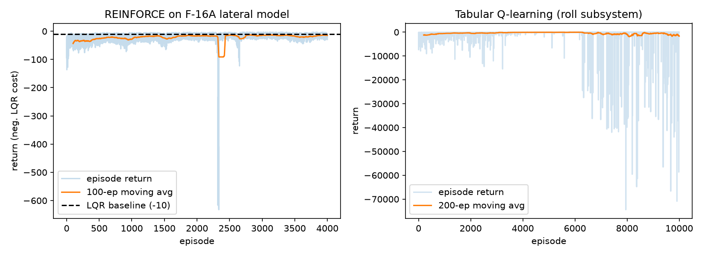
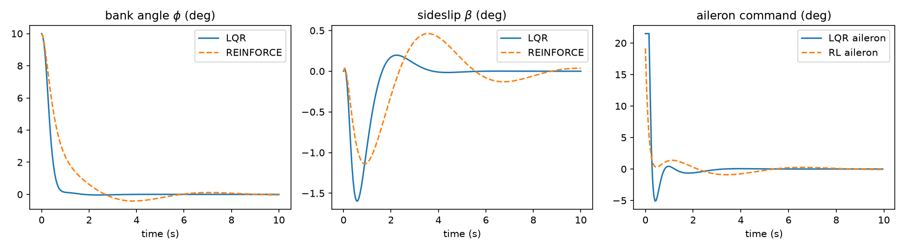

# Aircraft Flight Control Design

MATLAB flight-control design project for an F-16A lateral/directional linear
model with actuator dynamics and digital controller simulation, plus a Python
extension that trains reinforcement-learning agents on the same plant and
compares them against the discrete LQR baseline.

It contains the controller-design scripts and supporting routines for the
F-16A lateral/directional model.

## Highlights

- Modeled F-16A lateral/directional dynamics with aileron and rudder inputs.
- Added first-order actuator dynamics with position/rate command outputs.
- Designed digital controllers using LQR/SDR-style cost weighting.
- Implemented NZSP tracking, PI-SDR, PI-NZSP, and command/rate weighting cases.
- Simulated closed-loop state, control, command, and actuator-rate histories.

## Repository Structure

```text
controllers/
  sdr_regulator.m
  nzsp_tracking_control.m
  pi_sdr_integral_control.m
  pi_nzsp_tracking_control.m
  pif_nzsp_command_rate_weighting.m
utils/
  lqrdjv.m
  QPMCALC.M
python/                  (2026 extension: classical control vs RL)
  f16_env.py             Gym-style env, same plant/cost as the MATLAB designs
  lqr_baseline.py        discrete LQR via the discrete algebraic Riccati equation
  reinforce.py           REINFORCE from scratch (NumPy), Gaussian linear policy
  q_learning.py          tabular Q-learning from scratch, roll-axis subsystem
  compare.py             training + comparison plots
results/
  learning_curves.png
  trajectories.png
docs/
  project_summary.md
```

## Requirements

- MATLAB
- Control System Toolbox

Add the helper folder before running a controller script:

```matlab
addpath("utils")
run("controllers/nzsp_tracking_control.m")
```

## Classical Control vs Reinforcement Learning (Python extension, July 2026)

The `python/` package wraps the same F-16A lateral model (4-state core:
sideslip, roll rate, yaw rate, bank angle; ZOH-discretized at the original
T = 0.05 s) as a Gym-style environment with the LQR stage cost as reward,
then trains two from-scratch RL agents (NumPy only, no RL library) and
compares them with the discrete LQR solution on the nominal 10-degree
bank-angle disturbance:

| Controller | Return (negative LQR cost, 10 s episode) |
|---|---|
| Discrete LQR (Riccati) | **-10.04** |
| REINFORCE, Gaussian linear policy (greedy) | -13.94 |
| Tabular Q-learning, roll-axis subsystem (greedy) | -13.66, final bank angle -0.04 deg |

Both agents learn to regulate the disturbance; the policy-gradient agent
approaches but does not beat the Riccati solution it was measured against —
the expected result, and a useful reference point for when model-free
learning is worth its sample cost on a plant with a known linear model.

```bash
cd python
python3 compare.py   # trains both agents, writes plots to ../results
```




## Resume Summary

Designed and simulated digital flight-control laws for an F-16A
lateral/directional model in MATLAB, including actuator dynamics, LQR/SDR gain
selection, closed-loop modal analysis, and time-history evaluation of states,
commands, and control-surface rates.
